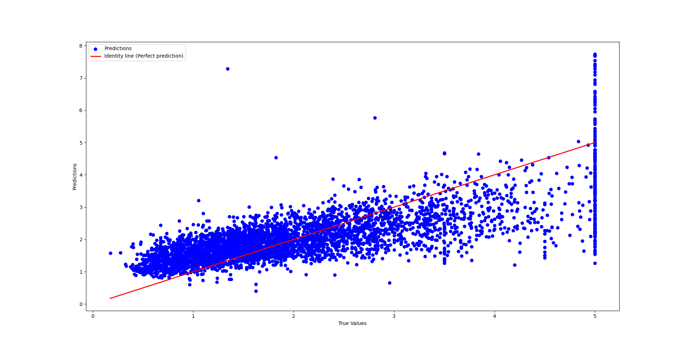
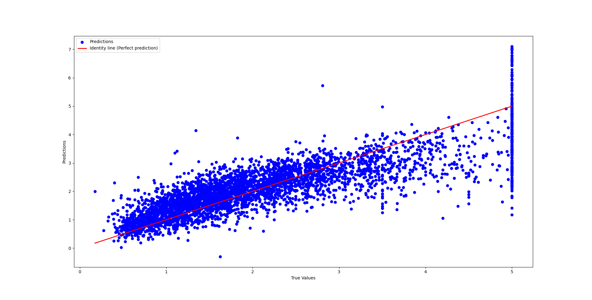
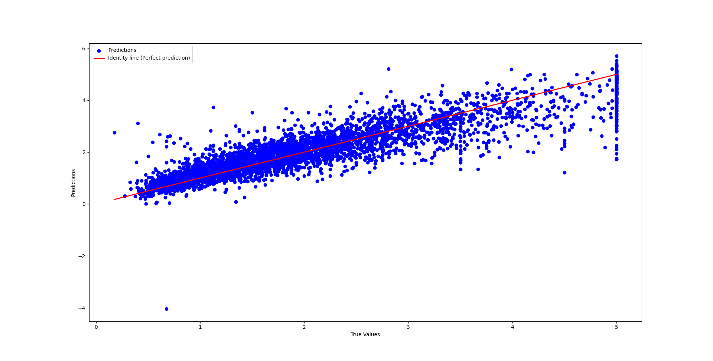
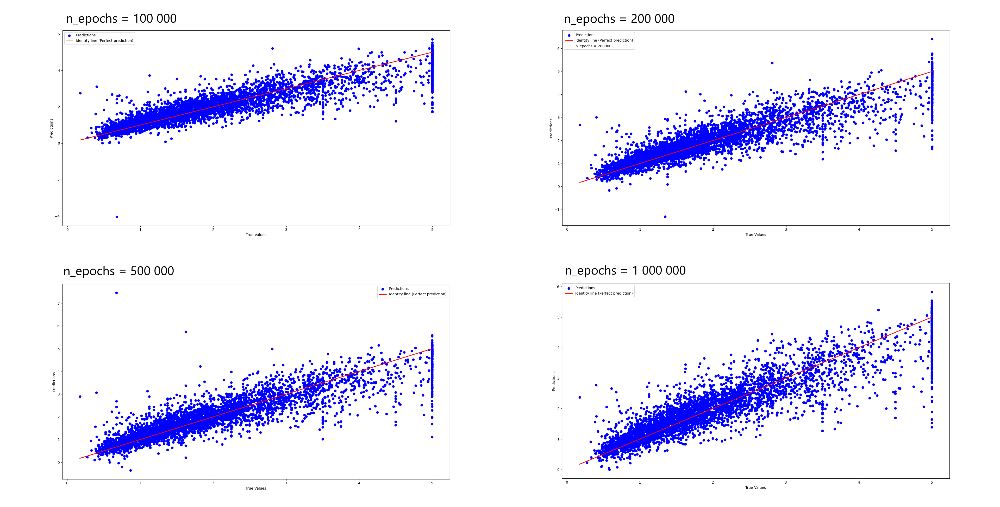

# Simple Regression Model made using Python and Pythorch

This is a simple regression model made using the pythorch library. It's a multilayer perceptron that uses the California housing prices dataset to training and testing. This model was only made for learning and teaching purposes. Below, there are some performances checks and results.

### Performance metrics

For this model, a bunch of feature tweaks were tested, and the results are shown below.

First off the model were trained with ```n_epochs = 100```

```
Test Loss: 0.7153
Mean absolute error: 0.6206
R-squared: 0.4621
```


Then, with ```n_epochs = 1000```

```
Test Loss: 0.4498
Mean absolute error: 0.4781
R-squared: 0.6618
```



After that, ```n_epochs = 100000```

```
Test Loss: 0.2838
Mean absolute error: 0.3641
R-squared: 0.7866
```


At this point, it seemed that the results started to converge and so i ran a couple tests with larger ```n_epochs``` and compared the results below.

First, these were the metrics for each distinct epoch number:

Number of epochs | Mean squared error | Mean absolute error | R Squared |
-----------------|---------------------|----------------------|------------
100 000 | 0.2838 | 0.3641 | 0.7866
200 000 | 0.2741 | 0.3584 | 0.7938
500 000 | 0.2781 | 0.3521 | 0.7909
1 000 000 | 0.2599 | 0.3489 | 0.8046

As it seemed, after 100 000 epochs the model improves at a low rate. This is also demonstrated by their Predicted vs True graphs. 



>[!IMPORTANT]
>this work was made entirely by me.
